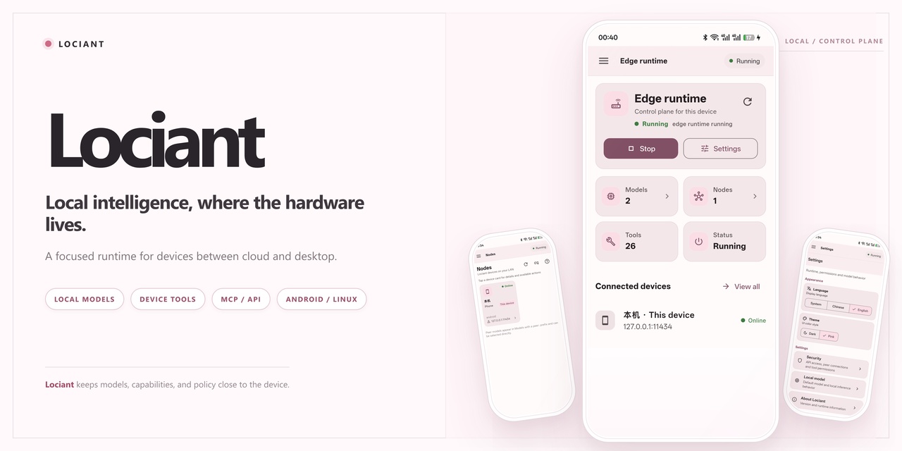

[English](README.md) | **简体中文**

# Lociant —— 把身边每一台设备，都变成你的 Agent

> 你的下一台 AI 设备，可能不是新电脑，而是抽屉里那台旧手机。

Lociant 让一台普通设备（旧手机、Linux 电脑、RK 开发板）成为真正能干活的
本地 Agent：它自己跑模型、自己看屏幕、自己动手操作，还能与你的其他设备
自动互联，并被 Claude、Codex 等 Agent 调用。数据默认留在本地，能力由你
逐项授权。

## 它能帮你做什么

- **把旧手机变成 7×24 的私人助理**：打开 App、查未读消息、点按钮、填表单——它真的会“动手”，不是只会聊天。
- **断网也能用**：模型跑在本地（手机 MNN、板子 NPU），不是套壳的在线聊天。
- **一台不够就组网**：手机、电脑、开发板同一局域网自动互联，互借模型和工具——手机可以直接用板子上的大模型。
- **接入任何 Agent**：Claude、Codex、OpenCode 通过 MCP 调用它的设备能力；也提供 OpenAI 兼容接口。
- **感知真实世界**：光线、距离、传感器、相机、屏幕状态——让 Agent 知道它“在哪里、在干什么”。
- **云端大脑（可选）**：配一个 OpenAI 兼容的云端模型，本地优先、云端按需，两不耽误。

比如：让 Agent 打开 QQ 看谁发了消息、总结 B 站动态、帮你把表单填好；或者
先“感觉”一下手机现在在口袋里还是桌上，再决定要不要亮屏动手。

## 三种玩法

| 设备 | 玩法 |
|---|---|
| 安卓手机 | 完整 Agent：云端/本地模型 + 手机工具（看屏、点击、传感器、相机） |
| Linux 桌面（x86_64） | 一个压缩包开箱即用：Flutter UI + 内置 Rust 后端 |
| RK 开发板（Armbian） | 无头常驻 + RKLLM NPU 推理 + 终端 TUI，7×24 低功耗 |

## 快速开始

支持三种玩法，按你的设备选对应章节：

- **安卓手机**：完整 Agent（云端/本地模型 + 手机工具）
- **Linux 桌面**：Flutter UI + 内置 Rust 后端，一个压缩包开箱即用
- **RK 开发板（无头）**：systemd 常驻 + RKLLM NPU 推理 + 终端 TUI

所有平台的下载、安装、配置、RKLLM 和多节点互联，见
**[配置指南（从零开始）](docs/setup-guide.md)**。

当前发布包：

[下载 Lociant v2.0.1 APK（Android arm64-v8a）](https://github.com/lhxll07/Lociant/releases/download/v2.0.1/lociant-2.0.1-arm64-v8a-release.apk) ·
[下载 Linux x86_64 桌面版](https://github.com/lhxll07/Lociant/releases/download/v2.0.1/lociant-2.0.1-linux-x86_64.tar.gz) ·
[下载 Linux aarch64 开发板版](https://github.com/lhxll07/Lociant/releases/download/v2.0.1/lociant-2.0.1-linux-aarch64.tar.gz)

Debian / Ubuntu 也可直接安装
[x86_64 桌面 DEB](https://github.com/lhxll07/Lociant/releases/download/v2.0.1/lociant_2.0.1_amd64.deb) 或
[arm64 无头节点 DEB](https://github.com/lhxll07/Lociant/releases/download/v2.0.1/lociant-node_2.0.1_arm64.deb)。

## 架构

一套 Flutter UI + Rust 后端跑在全部平台：Android 只保留设备层（无障碍、
传感器、悬浮窗、本地 MNN 推理），通过本地 IPC 给 Rust 提供工具；桌面端
UI 连接本机 Rust 服务；无头板子直接跑 systemd 服务并通过 RKLLM 走 NPU。
详见 [架构](docs/architecture.md)。

## 开发者

UI 是 Flutter，服务端是 Rust（`apps/rust-backend`），Android 是设备层。
开发、构建和完整接口说明见：

- [架构](docs/architecture.md)
- [配置指南（从零开始）](docs/setup-guide.md)
- [Android 开发说明](apps/android/README.md)
- [Agent 与 HTTP API（MCP、OpenAI、控制接口）](docs/agent-integration.md)

## 许可证

[MIT License](LICENSE)
